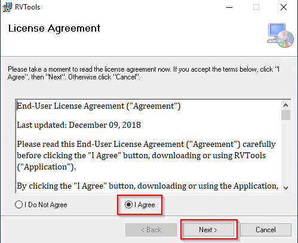
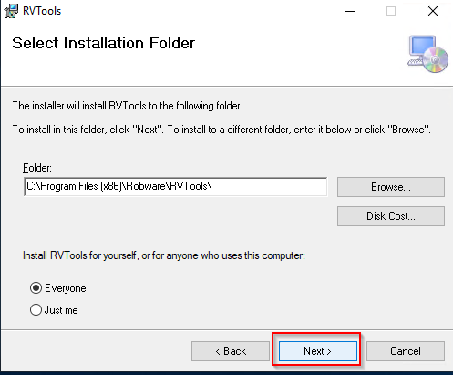
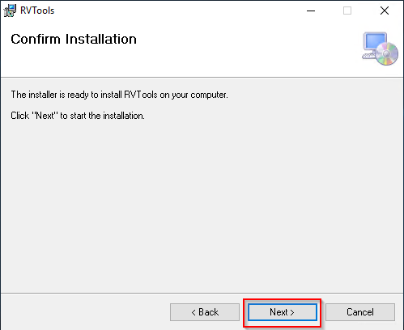
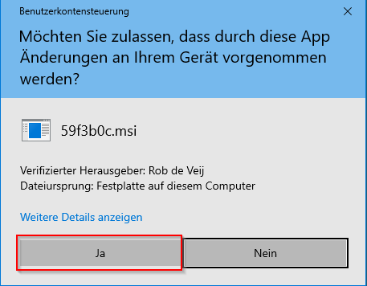
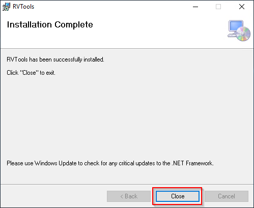
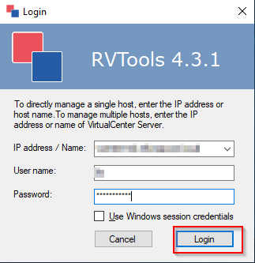
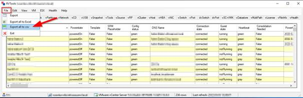
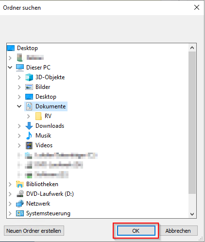
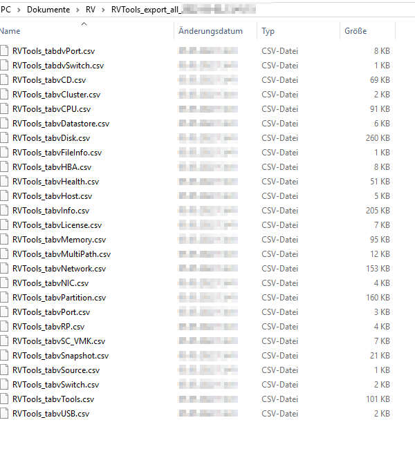

Short description to use RVTools:

1.  Download der RVtools von [https://www.robware.net/rvtools/](https://nam06.safelinks.protection.outlook.com/?url=https%3A%2F%2Fwww.robware.net%2Frvtools%2F&data=05%7C01%7CMaik.Sandmann%40microsoft.com%7Ce2d217151097462c192008da2e924715%7C72f988bf86f141af91ab2d7cd011db47%7C1%7C0%7C637873503086297088%7CUnknown%7CTWFpbGZsb3d8eyJWIjoiMC4wLjAwMDAiLCJQIjoiV2luMzIiLCJBTiI6Ik1haWwiLCJXVCI6Mn0%3D%7C3000%7C%7C%7C&sdata=B3%2FDgQLlDRAips4iJnhMwPytUmGcaEWTVVTOpfM53go%3D&reserved=0)
2.  Durch einen Doppelklick auf den RVtools MSI Installer wird die Installation gestartet.
3.  Den Anweisungen des Installations-Wizard folgen (siehe Abbildung 1-5).

    

Abbildung 1

Abbildung 2

Abbildung 3

Abbildung 4

Abbildung 5

1.  Nach erfolgreicher Installation starten, z.B. indem Sie RVTools über die Start-Eingabeaufforderung ausrufen.
2.  Daraufhin wird das RVTools Login-Interface angezeigt. Hier können Sie die IP-Adresse oder DNS und die Anmeldedaten eines vCenter-Servers eingeben und bestätigen mit Login (siehe Abbildung 6).

    

Abbildung 6

1.  Nach erfolgreicher Anmeldung können Sie den Export zu CSV durchführen (siehe Abbildung

    7).

    

Abbildung 7

1.  Angabe für den Export Pfad und bestätigen mit „OK“ (siehe Abbildung 8).

    

Abbildung 8

1.  Übersicht der exportierten Dateien (siehe Abbildung 9).

    

Abbildung 9
